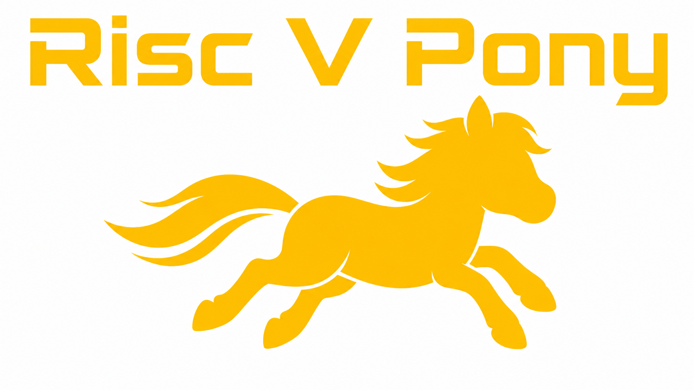

   

# RiscV Pony

A simple multi-cycle RiscV RV32E implementation.

Implement basics instructions like:

- Arithmetic
- Logic
- Load/Storage
- Branching

Supports running C code compiled for RV32E (see all supported instructions [here](./docs/supported_instructions.MD)).

[Read the documentation for project](docs/info.md)

For an architechtural overview check out [this document](./docs/architectural_overview.MD)

## Running tests

There's a whole lot of CocoTB tests to be run, some run C/Assembly code, check the full tests list [here](./docs/tests.MD)

For FPGA testing see the FPGA bringup document [here](./docs/fpga_bringup.MD)

## Built-in peripherals

A VGA driver and Gamepad interface was added to support the TinyTapeout PMODs, the peripheral were added to the core to maintain simplicity in the interface, this might be interpreted as a mixture of processing blocks with peripheral yes, but just to avoid the complexity of moving logic into the project.v file or somewhere else it was decided to go simmple and treat those peripherals as part of the code.

### The VGA peripheral

The VGA peripheral can drive all 8 pins of the output port, it uses the [H Sync Generator](./src/h_sync_generator.v) widely used for Demoscene projects.

By default the Output port is driven by a fake memory location of the CPU: 128h. A new register was created, the 140h, by default it gets 00h on reset and indicates that the Output ports is driven by the value written to the RAM address 128h.

When a value different to 00h is written to the RAM address 140h the output port becomes driven by the VGA Peripheral and thus that port can drive a VGA PMOD.

WIP: Video interface

### The Gamepad interface

The Gamepad interface gets constantly the signals from the input port, we don't have an activation for this. So the gamepad is always outputting key press information.

To read the Gamepad state a new read RAM address was added, the 144h, a read to that memory location returns 32 bits according to the following:

- Bits 31 to 13: read as zero
- IsPresent: Is present flag
- SELECT
- START
- LEFT
- RIGHT
- DOWN
- UP
- L
- R
- Y
- X
- B
- A

TODO: Change to 2 controls support

## What is Tiny Tapeout?

Tiny Tapeout is an educational project that aims to make it easier and cheaper than ever to get your digital and analog designs manufactured on a real chip.

To learn more and get started, visit https://tinytapeout.com.

## Set up your Verilog project

1. Add your Verilog files to the `src` folder.
2. Edit the [info.yaml](info.yaml) and update information about your project, paying special attention to the `source_files` and `top_module` properties. If you are upgrading an existing Tiny Tapeout project, check out our [online info.yaml migration tool](https://tinytapeout.github.io/tt-yaml-upgrade-tool/).
3. Edit [docs/info.md](docs/info.md) and add a description of your project.
4. Adapt the testbench to your design. See [test/README.md](test/README.md) for more information.

The GitHub action will automatically build the ASIC files using [LibreLane](https://www.zerotoasiccourse.com/terminology/librelane/).

## Enable GitHub actions to build the results page

- [Enabling GitHub Pages](https://tinytapeout.com/faq/#my-github-action-is-failing-on-the-pages-part)

## Resources

- [FAQ](https://tinytapeout.com/faq/)
- [Digital design lessons](https://tinytapeout.com/digital_design/)
- [Learn how semiconductors work](https://tinytapeout.com/siliwiz/)
- [Join the community](https://tinytapeout.com/discord)
- [Build your design locally](https://www.tinytapeout.com/guides/local-hardening/)

## What next?

- [Submit your design to the next shuttle](https://app.tinytapeout.com/).
- Edit [this README](README.md) and explain your design, how it works, and how to test it.
- Share your project on your social network of choice:
  - LinkedIn [#tinytapeout](https://www.linkedin.com/search/results/content/?keywords=%23tinytapeout) [@TinyTapeout](https://www.linkedin.com/company/100708654/)
  - Mastodon [#tinytapeout](https://chaos.social/tags/tinytapeout) [@matthewvenn](https://chaos.social/@matthewvenn)
  - X (formerly Twitter) [#tinytapeout](https://twitter.com/hashtag/tinytapeout) [@tinytapeout](https://twitter.com/tinytapeout)
  - Bluesky [@tinytapeout.com](https://bsky.app/profile/tinytapeout.com)
