# Testing RiscV Pony on FPGA

The first physical test of the RisdV Pony CPU was made on a [TangNano 20K](https://wiki.sipeed.com/hardware/en/tang/tang-nano-20k/nano-20k.html) FPGA using [Gowin EDA](https://www.gowinsemi.com/en/support/download_eda/) and [openFPGALoader](https://github.com/trabucayre/openFPGALoader) from WSL.

## Get setup

- Gowin EDA: You must create an account to download the software, also you must request a license with your machine's MAC address and that may take some 24h.
- For the openFPGALoader you can install it directly in WSL (Ubuntu 24 was used)

Note that to use the openFPGALoader in WSL you must redirect the USB from Windows to WSL, proceed as follows:

- Connect the TangNano to the USB port
- Open a PowerShell console (must be running with elevated privileges) and run the following command:

```bash
usbipd list
```
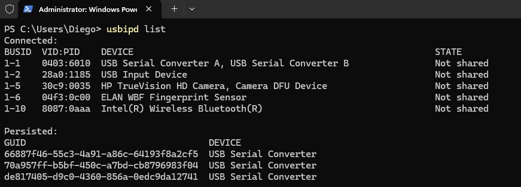

We see the device USB Serial Converter, that's our TangNano, we must share that one, then open the WSL terminal and run the following commands:

```bash
usbipd bind --busid 1-1
usbipd attach --wsl --busid 1-1
```

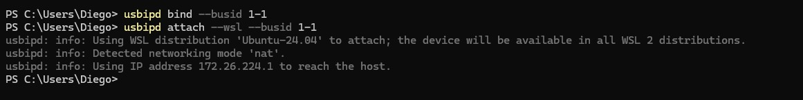

Then go to the WSL console and run:

```bash
lsusb
openFPGALoader --detect
```
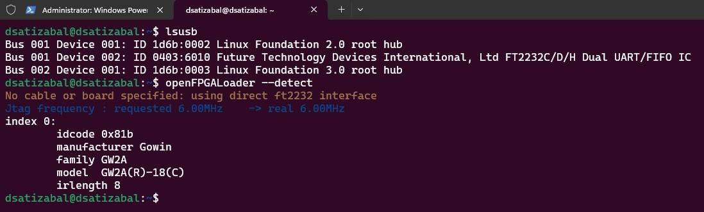

we're now ready to upload to the FPGA

## Create the Gowin project

Create a Gowin project, then you can add all the files you need.

For the first tests there are some modified version created to use a direct ROM access instead of using the SPI interface, you can find different versions of that first test in the [tangnano20kROM folder](../src/tangnano20kROM/). See that every folder inside of it has a RTL, Firmware and constraints sub folder.

- Ther RTL folder contains the top module, the rom fetcher that substitutes the SPI fetcher and some modified RTL files from the original implementation (core.v), the rest of the RTL files from the [src](../src/) must be added to the project.

- The constraints folder contains physical pin assignments definition that usually are made using the Gowin's EDA Floor Planner.

- The firmware folder contains assembly or C code (or both) used particularly for the given test, this is an independent folder, you must compile and get the hex file (a Makefile is provided for each version) and place the result within the project files

Observe that the RTL and constraints files vary from folder to folder so stick to each version every time.

Observe that the rom fetcher has this block of code:

```verilog
    initial begin
        $readmemh("firmware.hex", rom);
    end
```

So, the .hex file for the firmware you want to run must exists in the project's root directory

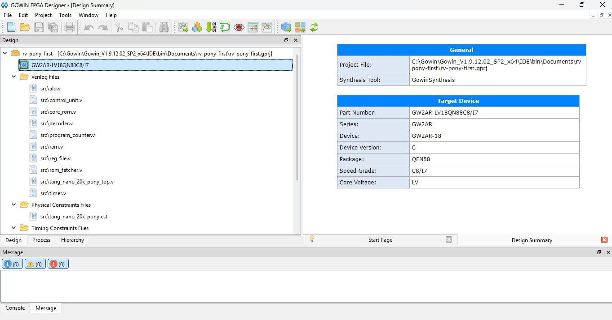

Run the entire process, if it succeeds you're ready to upload the file into the FGPA, use the following command:

```bash
openFPGALoader -b tangnano20k /mnt/c/Gowin/Gowin_V1.9.12.02_SP2_x64/IDE/bin/Documents/rv-pony-first/impl/pnr/rv-pony-first.fs
```

Change of course the .fs file path to yours.

Observe that the provided command loads the created bitstream into a volatile memory, you can test but changes get lost if you disconnect the FPGA.

## Testing the SPI interface with TangNano

To avoid accumulating a bunch of possible failure factors that make it harder to find any issue first a test for only the SPI memory was performed.

We're using [TinyTapeout's QSPI PMOD](https://store.tinytapeout.com/products/QSPI-Pmod-p716541602) that includes a 128 Mbit Flash and 2 64 Mbit RAM chips, both supporting Single/Dual/Quad SPI modes. You can get one of those directly from the [TinyTapeout store](https://store.tinytapeout.com/) or get one from, for example JLCPCB, by getting [the KiCad from the PMODs repo](https://github.com/mole99/qspi-pmod), generating the gerber files and place an order.

So, in the [TangNanoBringUp folder](../src/TrangNanoBringUp/) there are 3 files:

- tang_nano_spi_flash_led_demo_top.v: The top module for the SPI PMOD tests
- spi_flash_led_demo_core.v: Kind of a core that uses the SPI fetcher to read from the SPI memory and show the data in the leds
- tang_nano_spi_flash_led_demo.cst: The physical constraints for pins assignment (Floor Planning)

> [!IMPORTANT]  
> To use the files listed above you have to also include the CPU's memory interface [SPI Fetcher](../src/spi_fetcher.v) as that's the module under test in this first part.

Those file constitute a basic test circuit that will read memory locations from the 0x00000000 to 0x00000040 and render the lowest 6 bits in the TangNano's leds, so we can generate a BIN file that contains particular sequences written into that address range, and the circuit will read a 32-bit word, and will send to the leds byte by byte.

Now, here we discovered some issues, and we had to perform some debugging using different codes, let's take a look at that journey so you can be aware of the pitfalls you may encounter.

### Preparing the PMOD

If you plan to use a TinyTapeout DevBoard with the SPI flasher to write BIN files in the ROM you will have to do a first step before being able to use it.

According to the W25Q128JV specs, we must set the QE bit of the status Register-2 to enable QSPI mode, by default the TinyTapeout flasher uses that mode so we must set it first.

- Plug in the QSPI PMOD in the _BIDIR_ socket of your TT Dev board

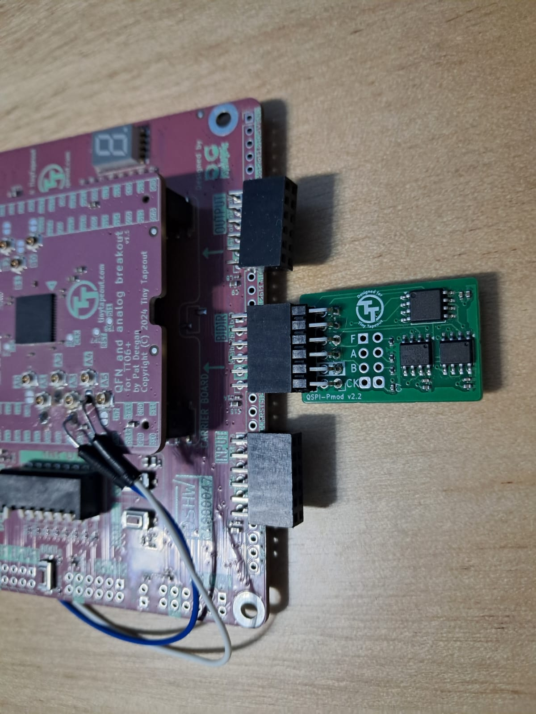

- Go go the [TinyTapeout commander](https://commander.tinytapeout.com/), plug in your board and select _CONNECT TO BOARD_ you must see a modal allowing you to select your detected board

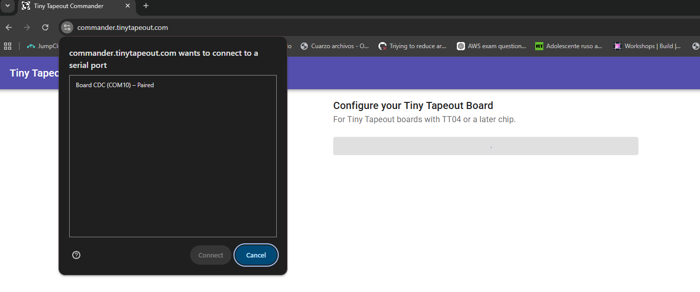

- After connecting the board select the _Index 0_ in the config tab and head to the _REPL_ tab

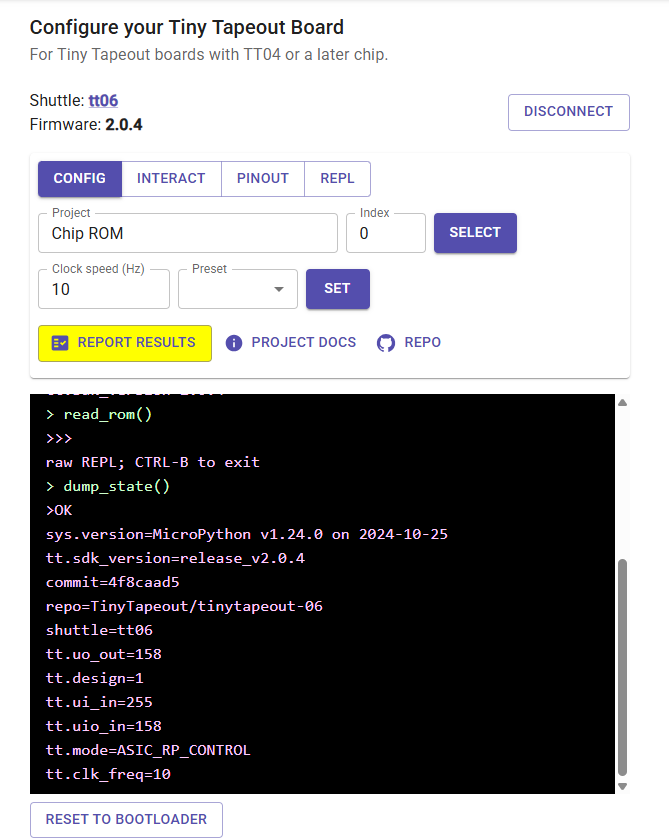

- The _REPL_ tab gives you access to the Micropython where you can run scripts, here some basics commands you can use:

- - ctrl + E = Enter paste mode
- - Ctrl + Shift + V = paste
- - Ctr + D = End paste mode

- Enter the Paste mode and paste the attached [QSPI Activation Script](./scripts/QSP_Activation_Script.py) entirely
- Press _Ctrl + D_ to finalize the paste mode
- In the uPython prompt (>>>) write _run_test()_, observe it is a function declared in the python code you pasted, you must see the process going and get the following outputs if it suceeds:

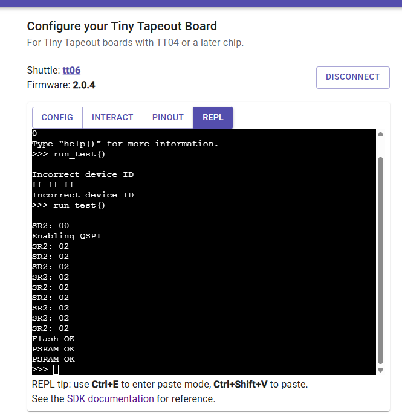

- After this you're ready to write a BIN file in the Flash memory, go to the [TinyTapeout flasher](https://tinytapeout.github.io/tinytapeout-flasher/) and connect the board as you did for the commander (you must disconnect from the commander first)
- If everything's OK you must see now the Flash ID as ef7018 (not 000000 anymore), and you can select a BIN file either from your computher or one of the predefined demos, the prcess must go smoothly

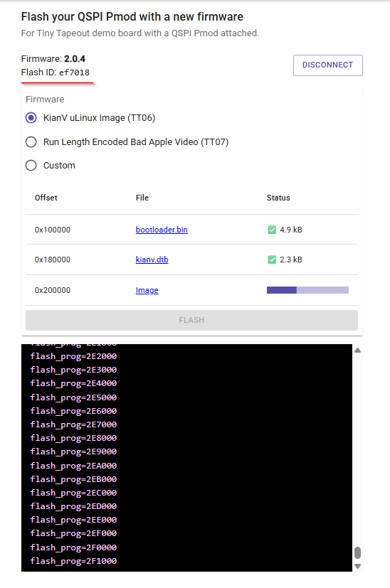

Another useful script used for debug was the [SPI reader for the TT commander](./scripts/upython_flash_reader.py), this one allows to read memory locations (limited to 4 bytes as it is but expandable to more if needed).

> [!NOTE] 
> Note: that you can continue using the QSPI memory as 1-bit or 4-bit interface according to your design

> [!IMPORTANT]  
> If you're not using the TT Dev Board + the flasher you may obviate the above-described procedure and leave the default value for QE bit

### Fools proof PMOD pinout

The author needed a more clear explanation of the PMOD pinout, the source of the truth was the KiCad design, from there the following image was created:

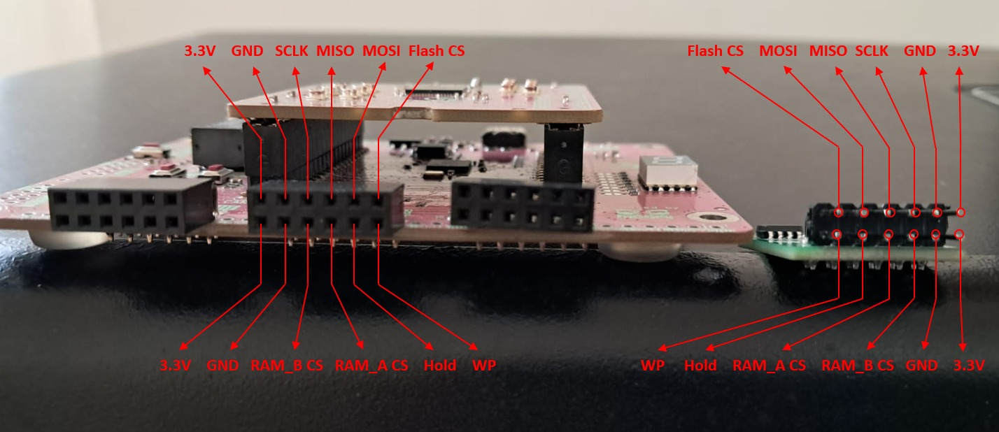

### Creating BIN files with a given sequence

To generate a BIN file that you can write to your memory a [generation script](./scripts/generate_spi_led_pattern.py) is being provided, just edit the given pattern and run the script, you will get a TXT file showing the written patter in a hex-like format and the BIN file, observe that the initial address will be 0x00000000

### Pins used in TangNano 20K

The following pins are used for TangNano to drive the PMOD, observe that the singals: WP, HOLD, RAM_A CS and RAM_B CS can be connected directly to 3.3V as those are always high for RiscV Pony

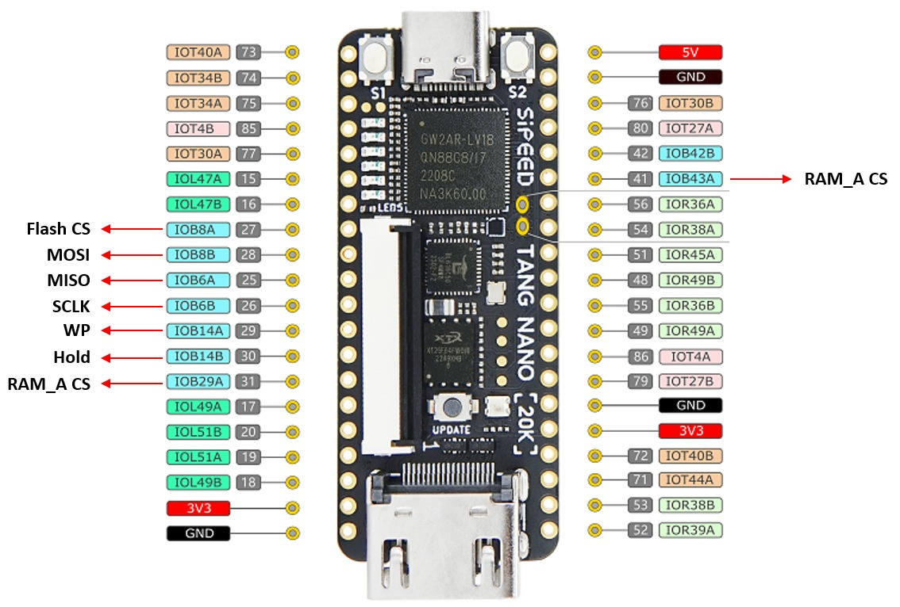

### First test: reading JEDEC ID

> This is an optional step, it was desired to leave all work done to get the RiscV Pony working documented, you con skip this and the next section if you just want to get the CPU running

We can use a simple module to just send the _9Fh_ command to the Flash memory and expect to read 3-bytes ID that must return _EFh 70h 18h_ for our case

Use the [JEDEC ID Reader](./scripts/jedec_id_reader.v) along with the [Gowin Top Module for the FPGA BringUp](../src/TrangNanoBringUp/tang_nano_spi_flash_led_demo_top.v) to perform this read, put that file inside the project and wire it up as follows:

```verilog
jedec_id_reader #(
    .DISPLAY_DELAY_CYCLES(32'd1_000_000),
    .CS_SETUP_CYCLES(8'd16),
    .CS_HOLD_CYCLES(8'd16)
) demo (
    .clk(slow_clk),
    .rst_n(rst_n),

    .spi_cs_n(flash_cs_n),
    .spi_sck(flash_sck),
    .spi_mosi(flash_mosi),
    .spi_miso(flash_miso),

    .led_pattern(led_pattern)
);
```
See that this replaces the core and thus the [SPI fetcher](../src/spi_fetcher.v) used for the FPGA Bringup, conserve those files though as, after a succesful read of the JEDEC ID we'll switch to reading through the [SPI fetcher](../src/spi_fetcher.v) again

Build the project and flash the TangNano bitstream, make sure you have the PMOD properly attached to the FPGA and run, you must see a led sequence showing the 6 nibbles of the JEDEC ID read, if you do you have the PMOD working now.

> [!IMPORTANT]  
> Observe that for the tests we used a seconday clock generated from the 27 MHz clock of the TangNano, during the first tests, to make sure we were not hitting a timing issue we divided the frecuency by 13 to get 1 MHz aproximately, this parameter can be changed in line 51 of the [TangNano bring up Top module](../src/TrangNanoBringUp/tang_nano_spi_flash_led_demo_top.v)

### Moving onto real memory

Now that the Flash's ID's been read properly we can try to read memory locations. At this point it is assume that you have written a sequence BIN file into the Flash starting at 0x00000000, either by performing the previously described procedure or by any other mean.

Remove the [JEDEC ID Reader](./scripts/jedec_id_reader.v) and restore the changes in the [TangNano bring up Top module](../src/TrangNanoBringUp/tang_nano_spi_flash_led_demo_top.v) so it uses the core and the SPI Fetcher.

You can initially leave a high value for the clock divider used to generate the secondary clock for the core and thus the SPI reader, but it was tested providing the full 27MHz clock and it worked.

Use Gowin to build the bitstream again, make sure you have the PMOD properly conected and load the bitstream into the FPGA. You must now see the leds showing the sequence you flashed into the ROM, this indicates that the SPI Fetcher is prepared properly read instructions to be execured by the rest of the Pony CPU.

## Test of the RiscV Pony in TangNano 20K


